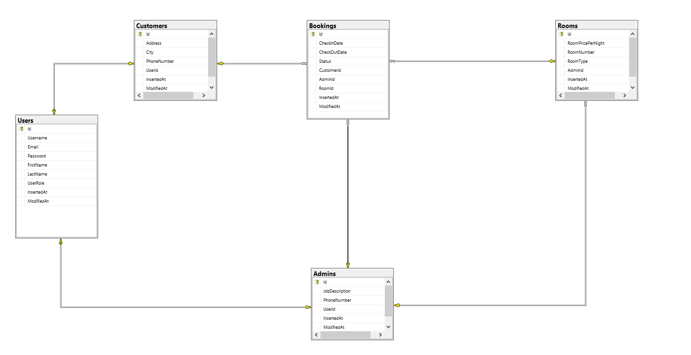
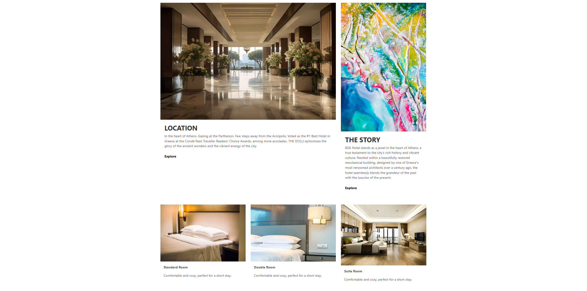
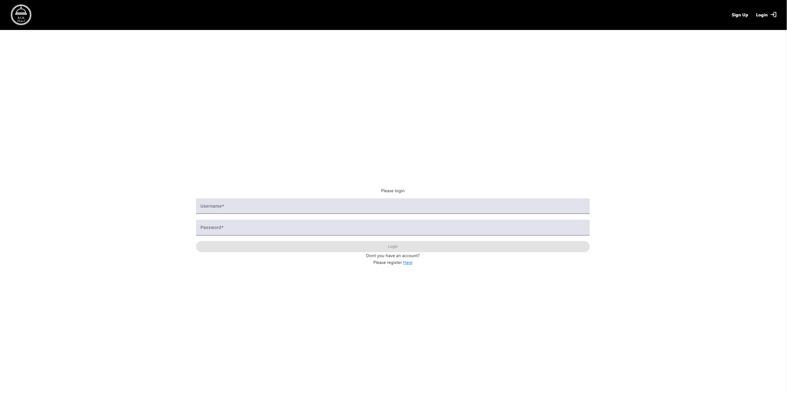
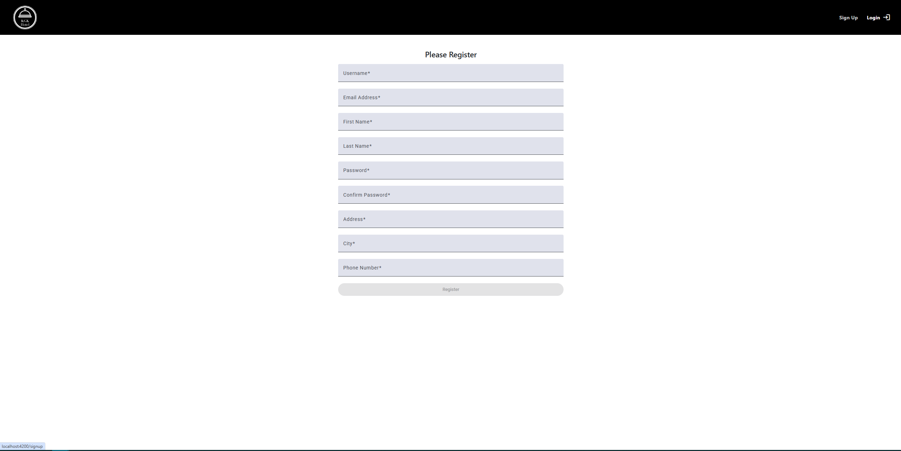
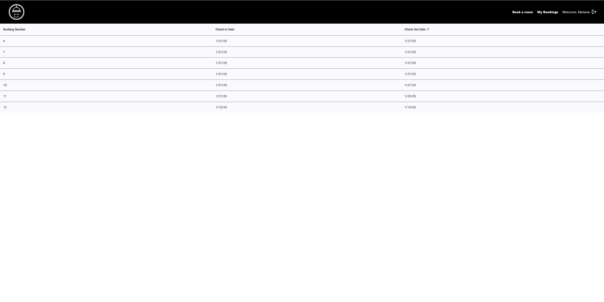
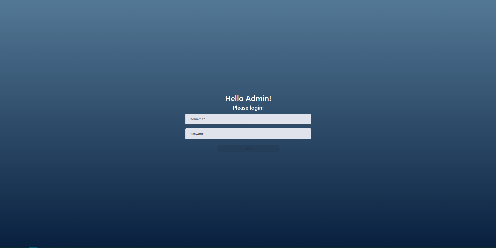
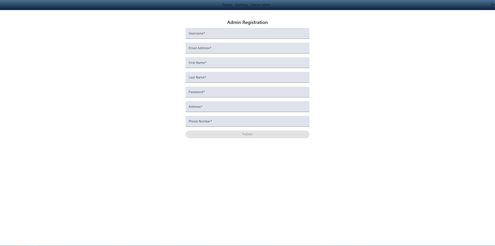
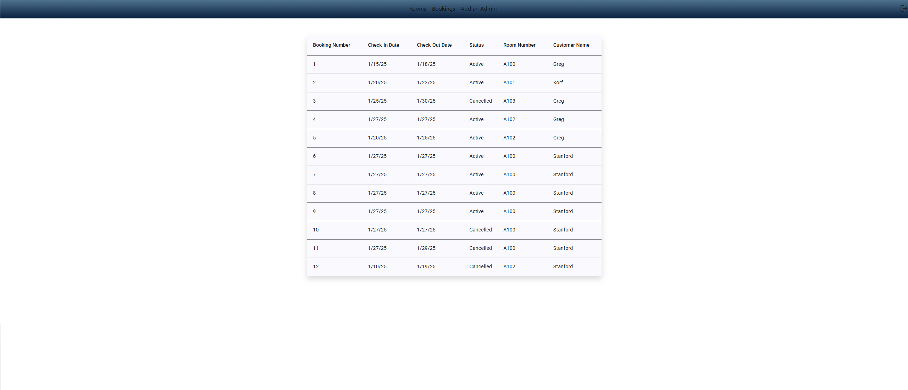

# HotelBookingApp# 🏨 Hotel Booking Application

A web application for hotel booking management with Angular frontend and C# backend.

 <!-- Add a screenshot of your application here -->

## ✨ Features

DONE ✅

- 📅 View Booking History
- 👥 User registration and authentication
- 📝 Booking management
- 📱 Responsive user interface

TO-DO 🚧⏳🔄🔜

- Implement the booking system with more proper bussiness way
- Add room update/create on the frontend
- Add booking status update on the frontend

## 🚀 Technologies Used

- **Backend Framework:** .NET
- **Programming Language:** C#
- **Database:** SSMS
- **ORM:** Entity Framework
- **Frontend:** Angular
- **Authentication:** JWT
- **Version Control:** Git
- **Design:** REST API

## 📋 Prerequisites

- Visual Studio 2019/2022
- Node.js (v16+)
- Angular CLI
- .NET SDK
- SQL Server
- Git

## 🛠️ Installation

1. Clone the repository

```bash
git clone https://github.com/GregKorf/HotelBookingApp.git
```

## Backend Setup

1. Navigate to the Backend file

```bash
cd Backend
```

2. Open appsettings.json & Configure connection string

3. Install Dependencies

```bash
dotnet restore
```

4. Database Migration

```bash
dotnet ef database update
```

5. Run Application

```bash
dotnet run
```

It should run on port: 5002

You can check the api doc at https://localhost:5002/swagger/index.html

### At Swagger Page you can test all the api endpoints that my app has right now until the next update

## Frontend Setup

1. Open the Frontend file into VS Code

2. Type npm install at the terminal

```bash
npm install
```

3. Run the Frontend

```bash
ng serve
```

It should run at port: 4002

## DB Schema



## Customer Page

Landing Page:



Login Page:


Singup Page:


Customer Booking history:


## Admin Page

Admin Landing Page:


Admin Registration Page:


Admin Manage Bookings Page:


## Work Flow (Must Read)

### Admin

The admin page is a totally different app from the customer page.

If you want to enter the admin page u should enter this link:
http://localhost:4200/admin/login

Admin can see all the bookings and he can change the status to cancelled
Admin can create a room and update the price of the room.
Only an admin can register new admin/manager of the hotel booking.

#### For this reason there is another step that you should do to start using the admin page.

1. Open Swagger and at the api/admin/SignUpAdmin just register the first user on your db.

### Customer

The customer page starts with the landing page where you can find some content of the hotel.
http://localhost:4200/

Customer has to signup and then login.
He can now check his booking history.
Book a room will be Implement asap in next update.

## License

[MIT](https://choosealicense.com/licenses/mit/)
